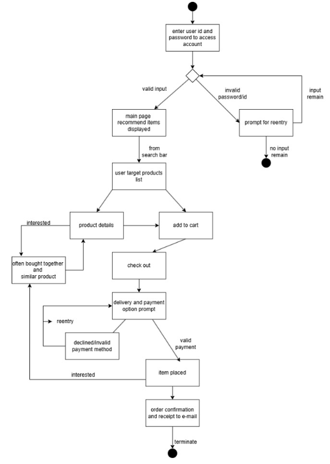
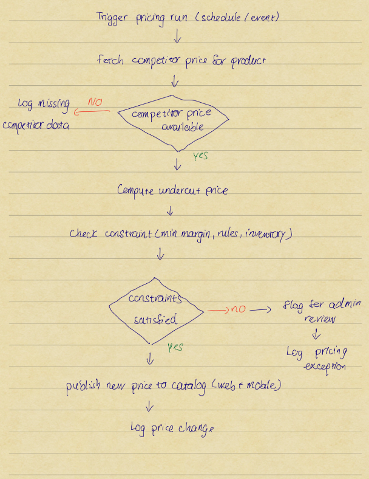

### CPSC-362-03 18576 Group 4 Project - E-commerce Website
## An online retail platform that offers customers products at undercut prices derived from competitor market values. (ex: Amazon, Walmart) The undercutting marketplace is accessible for purchasing, selling, and browsing products via a website and smartphone app.

## Project Description
# Features
1. Shopping Cart System
* Tax, Sale, Discount
* Persistent cart state
* Asynchronous cart updating
2. Checkout System
* Payment Processing
* Shipping
* Inventory update
* Receipt generation
3. Search results
* Default order of search result listing
* Search result filtering by categorization
4. Database for product information:
* inventory, product name, brand name, product description, etc
5. Active monitoring of product prices on competitor websites
6. User account database
* Storing of username, password, and email address
* Saved shipping and billing information
* Favorited items 
* Order history receipts
* Security events log 
7. Mobile app with all website features

## Product Diagrams

